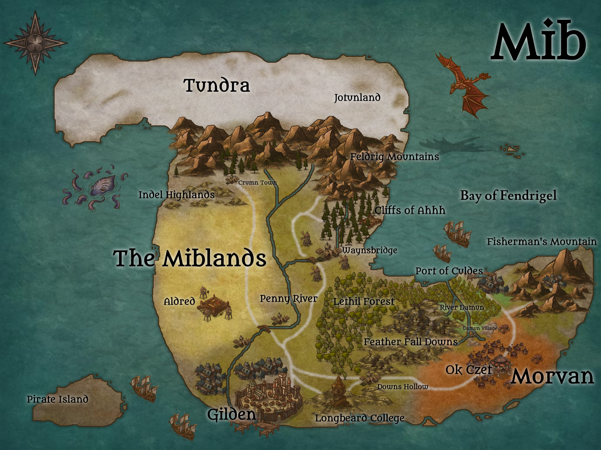

# Mib

## The Western Kingdom and Miblands

### Gilden

#### Districts

Lowtown

     
    <ul>
    <li>The streets that arc away from the lower docs into the seedier parts of town.</li>
    <li>Known for crime, shady deals, and a fun night or two.</li>
    <li>The outermost ring of the city</li>
    <li>Places of Business
      <ul>
        <li>Darkhorse Tavern
          <ul>
            <li>Owned and operated by Martin Lynch</li>
            <li>Cheap rooms for rent</li>
            <li>Frequented by completely legitimate businessman, Freddy Brindson</li>
          </ul>
        </li>
      </ul>
    </li>
    </ul>

- The Docks
  - Places of Business
    - The Lonely Whale Tavern
      - Best oysters in town, frequented by Triton diplomats from Equeth

- The Farthings
    - Middle Ring in the Eastern and Northern parts of Gilden
    - Places of Business
        - The Slippery Slope
            - Owned by Dremma, a female gnome
            - Other Employees:
                - Heela the halfling serving girl
                - Teek the goblin busser
                - Forla the female halfling cook

- Goldstones
    - The wealthy inner circle of Gilden, home to upper crust nobles such as [Lord and Lady Amus Wellingsby](npcs/amus.md)
    - Places of Business
        - Jared Kaylen the Jeweler

- Crown Hill
  - Centermost part of the city
  - The small hill upon which sits the royal palace

### Waynsbridge

### Port of Culdes

### Aldred
